# CLAUDE.md - Project X Prop Firm

## Overview
This is the **world's first Prediction Market Prop Firm** - a simulated trading platform where users trade on Polymarket/Kalshi data with our capital. Built with Next.js 16, React 19, PostgreSQL, Redis, and real-time WebSockets.

## Quick Commands
```bash
npm run dev      # Start dev server (localhost:3000)
npm run build    # Production build
npm run lint     # ESLint
npm run test     # Vitest unit tests
npm run db:push  # Push Drizzle schema to PostgreSQL
docker-compose up -d  # Start Postgres + Redis
npx tsx src/workers/ingestion.ts  # Start price ingestion worker
```

## Tech Stack
- **Framework**: Next.js 16 (App Router), React 19
- **Database**: PostgreSQL (Drizzle ORM), Redis (cache + pub/sub)
- **Auth**: NextAuth v5 (email/password + OAuth)
- **UI**: Tailwind v4, Shadcn/ui, Framer Motion, Radix
- **Real-time**: Redis pub/sub, WebSocket price streams
- **Charts**: TradingView Lightweight Charts
- **Voice AI**: Vapi (@vapi-ai/web)
- **Analytics**: Vercel Analytics, Sentry
- **Markets**: Polymarket CLOB client, Kalshi API

## Project Structure
```
src/
├── app/              # Next.js routes (19 routes)
│   ├── admin/        # Admin dashboard (rules, users, payouts)
│   ├── api/          # 66 API routes
│   ├── checkout/     # Payment flow
│   ├── dashboard/    # Trader dashboard
│   └── trade/        # Trading interface
├── components/       # 179 components
│   ├── dashboard/    # DashboardView, LandingHero, LandingContent
│   ├── trading/      # OrderBook, MarketGrid, TradeModal
│   ├── admin/        # AdminDashboard, RulesEditor
│   └── ui/           # Shadcn components
├── config/           # plans.ts (pricing tiers), trading.ts
├── db/               # Drizzle schema (20+ tables)
├── hooks/            # usePageContext, useMarketData, etc.
├── lib/              # 46 utility modules
│   ├── trade.ts      # Trade execution engine
│   ├── risk.ts       # Drawdown/loss calculations
│   ├── evaluator.ts  # Challenge pass/fail logic
│   ├── payout-service.ts  # Payout processing
│   └── vapi-config.ts     # Voice AI config
└── workers/          # Background jobs (ingestion, etc.)
```

## Business Logic

### Pricing Tiers (src/config/plans.ts)
| Tier | Size | Price | Profit Target | Drawdown |
|------|------|-------|---------------|----------|
| Scout | $5K | $79 | 10% ($500) | 8% |
| Grinder | $10K | $149 | 10% ($1,000) | 10% |
| Executive | $25K | $299 | 12% ($3,000) | 10% |

### Challenge Flow
1. **Challenge Phase**: Hit profit target without violating drawdown
2. **Verification Phase**: Repeat performance (same rules)
3. **Funded Phase**: Trade live, 80-90% profit split, bi-weekly payouts

### Key Rules Engine (src/lib/risk.ts, evaluator.ts)
- Max Drawdown: Static % of initial balance
- Daily Drawdown: % of start-of-day balance
- Velocity Fees: 0.05% daily carry cost for positions held >24h
- Min Trading Days: 5 days before payout eligible

## Technical Architecture

### Price Ingestion Pipeline
```
Polymarket API (WebSocket + REST)     Kalshi API (WebSocket + REST)
              ↓                                   ↓
        ingestion.ts                      kalshi-ingestion.ts
              ↓                                   ↓
     Redis (Upstash) ← Leader Election (prevents duplicates)
              ↓
     /api/markets/stream (SSE endpoint)
              ↓
     Frontend (LivePositions, useMarketStream hook)
```

**Key Files:**
- `src/workers/ingestion.ts` - Polymarket WebSocket, leader election
- `src/workers/kalshi-ingestion.ts` - Kalshi WebSocket with REST fallback
- `src/workers/leader-election.ts` - Redis-based leader lock
- `src/lib/market.ts` - MarketService for reading prices, order books
- `src/app/api/markets/stream/route.ts` - SSE endpoint for frontend

**Data Flow:**
1. **Leader Election** ensures only one worker ingests at a time
2. **WebSocket** connects to `wss://ws-live-data.polymarket.com`
3. **Price buffer** batches updates (1s flush interval)
4. **SSE endpoint** streams prices to frontend every 1s
5. **Redis keys**: `event:active_list`, `kalshi:active_list`, `market:price:{id}`, `market:book:{id}`

### Trade Execution Model (B-Book)
Trades execute against our internal system using real order book data for slippage simulation.

```
User Trade Request (with options: {maxSlippage?, shares?})
      ↓
RiskEngine.validateTrade() [9 pre-trade rules]
      ↓
MarketService.calculateImpact() [walk order book for VWAP]
      ↓
maxSlippage check (reject if slippage > user limit)
      ↓
SELL by shares? → derive amount from shares × price
      ↓
DB Transaction (row lock for race prevention)
      ↓
PositionManager.openPosition() or .reducePosition()
      ↓
BalanceManager.deductCost() or .creditProceeds()
      ↓
ChallengeEvaluator.evaluate() [async]
      ↓
Return: trade + {priceAge, priceSource}
```

**Key Files:**
- `src/lib/trade.ts` - TradeExecutor.executeTrade()
- `src/lib/trading/PositionManager.ts` - Position CRUD
- `src/lib/trading/BalanceManager.ts` - Balance adjustments

---

## Technical Flow Diagrams

### 1. Order Book VWAP Walk (Slippage Calculation)
How we simulate real market impact by walking the order book:

```mermaid
flowchart TD
    A["Trade Request: BUY $1000"] --> B["Get Order Book from Redis"]
    B --> C{"Book Source?"}
    C -->|demo| REJECT["❌ REJECT: No liquidity feed"]
    C -->|live/synthetic| D["Walk the Asks (for BUY)"]
    
    D --> E["Level 1: 0.55 × 5000 shares = $2750"]
    E --> F{"$1000 < $2750?"}
    F -->|Yes| G["Take partial: $1000 ÷ 0.55 = 1818 shares"]
    F -->|No| H["Take all 5000 shares, continue to Level 2"]
    
    G --> I["Calculate VWAP: $1000 ÷ 1818 = 0.55"]
    H --> J["Level 2: 0.56 × 3000 shares..."]
    J --> K["Sum all levels → VWAP"]
    
    I --> L["Slippage = (VWAP - TopOfBook) ÷ TopOfBook"]
    K --> L
    L --> M{"Slippage > maxSlippage?"}
    M -->|Yes| N["❌ REJECT: Slippage exceeded"]
    M -->|No| O["✅ Execute at VWAP"]
```



### 2. Position Lifecycle
How positions flow from open to close:


### 3. Challenge State Machine
The full lifecycle of a trading challenge:


### 4. Risk Evaluation Flow (Pre-Trade + Post-Trade)
The two-layer protection system:

```mermaid
flowchart TD
    subgraph PreTrade["PRE-TRADE (RiskEngine)"]
        A["Trade Request"] --> B{"Balance Check"}
        B -->|Fail| R1["❌ Insufficient Funds"]
        B -->|Pass| C{"Max Drawdown Check"}
        C -->|Would Breach| R2["❌ Would breach max drawdown"]
        C -->|OK| D{"Daily Loss Check"}
        D -->|Would Breach| R3["❌ Would breach daily limit"]
        D -->|OK| E{"Position Exposure"}
        E -->|>5% single market| R4["❌ Concentration limit"]
        E -->|OK| F{"Category Exposure"}
        F -->|>10% single category| R5["❌ Category limit"]
        F -->|OK| G["✅ Trade Allowed"]
    end
    
    G --> H["Execute Trade"]
    
    subgraph PostTrade["POST-TRADE (Evaluator)"]
        H --> I["Recalculate Balance"]
        I --> J{"Check Drawdown"}
        J -->|Breached > Max| K["🔴 HARD FAIL → status = failed"]
        J -->|Breached > Daily| L["🟡 SOFT FAIL → pendingFailureAt = now"]
        J -->|OK| M{"Check Profit Target"}
        M -->|Reached| N["🟢 PASS → status = passed"]
        M -->|Not yet| O["Continue trading"]
    end
```



### 5. Daily Reset Process (00:00 UTC)
What happens at midnight every day:


### 6. Payout Eligibility Flow (Funded Accounts)
Requirements to request a payout:

```mermaid
flowchart TD
    A["Trader Requests Payout"] --> B{"Net Profit > $0?"}
    B -->|No| R1["❌ No profit to withdraw"]
    B -->|Yes| C{"Min Trading Days Met?"}
    
    C -->|"<5 days"| R2["❌ Need 5 active trading days"]
    C -->|"≥5 days"| D{"Consistency Check"}
    
    D -->|">50% from single day"| R3["⚠️ Flagged for review"]
    D -->|OK| E{"Any Rule Violations?"}
    
    E -->|Yes| R4["❌ Violations block payout"]
    E -->|No| F{"KYC Verified?"}
    
    F -->|No| R5["❌ Complete KYC first"]
    F -->|Yes| G["Calculate Payout"]
    
    G --> H["Gross Profit × Split % (80-90%)"]
    H --> I{"Exceeds Payout Cap?"}
    I -->|Yes| J["Cap at startingBalance"]
    I -->|No| K["Full amount"]
    
    J --> L["✅ Payout Approved"]
    K --> L
    L --> M["Send to Admin Queue"]
```



---

### Evaluation & Risk System

**Two-Layer Validation:**
1. **Pre-Trade** (RiskEngine) - Blocks trades that would breach limits
2. **Post-Trade** (Evaluator) - Checks for breaches after execution

**Pre-Trade Rules (src/lib/risk.ts):**
| Rule | Limit |
|------|-------|
| Max Total Drawdown | 8% |
| Max Daily Loss | 4% of SOD |
| Per-Market Exposure | 5% |
| Per-Category Exposure | 10% |
| Min Market Volume | $100k |
| Max Open Positions | 10-20 (tiered) |

**Post-Trade Evaluation (src/lib/evaluator.ts):**
| Check | Breach Type | Effect |
|-------|-------------|--------|
| Max Drawdown | HARD | Immediate failure |
| Time Expiry | HARD | Immediate failure |
| Daily Loss | SOFT | `pending_failure` (can recover) |
| Profit Target | PASS | Transition to funded |

### Checkout & Challenge Creation
- **Mock Mode**: `/api/checkout/create-confirmo-invoice` creates challenge instantly
- **Production**: Confirmo webhook at `/api/webhooks/confirmo` creates challenge
- **Key File**: `src/lib/challenges.ts` - ChallengeManager

### Dashboard Data
- **Main Function**: `getDashboardData()` in `src/lib/dashboard-service.ts`
- Aggregates: user stats, challenge metrics, open positions, P&L

## Database Schema (src/db/schema.ts)
**Core Tables:** users, challenges, positions, trades, payouts
**Auth:** accounts, sessions, verificationTokens, user2FA
**Business:** businessRules, discountCodes, affiliates, certificates

## Design System (Current: Vapi-Inspired)
- **Background**: Pure black (#000000)
- **Accent**: Mint (#4FD1C5)
- **Text**: White headings, Cool Gray body (#94A3B8)
- **Borders**: Thin 1px (#1E293B)
- **Patterns**: Dot-grid background, atmospheric corner glows
- **Typography**: Monospace for labels/stats (mono-label class)
- **Components**: thin-border-card, pill-btn, pill-btn-mint

## Key Components

### Landing Page
- `LandingHero.tsx`: Hero with ProbabilityOrbs animation
- `LandingContent.tsx`: How It Works, Pricing, Academy sections
- `Navbar.tsx`: Navigation with mint dashboard CTA
- `ProbabilityOrbs.tsx`: Floating % circles animation

### Trading
- `DashboardView.tsx`: Main trading interface
- `MarketGridWithPolling.tsx`: Market display with 10-second auto-refresh
- `MarketGridWithTabs.tsx`: Static market display (no polling)
- `TradeModal.tsx`: Order entry
- `RiskMeter.tsx`: Live drawdown gauge

### Hooks
- `useMarketPolling.ts`: 10-second polling for live market data

### Voice AI (Vapi)
- `VoiceAssistant.tsx`: Mic button, auto-prompt after 90s
- `src/lib/vapi-config.ts`: API keys from env
- `src/lib/analytics.ts`: Voice AI attribution tracking

## Environment Variables
Required in `.env.local` (local dev) and in Vercel/Railway dashboards (production):

### Authentication
```
AUTH_SECRET=...                  # NextAuth session encryption
NEXTAUTH_URL=...                 # Auth callback URL
```

### Database
```
DATABASE_URL=postgresql://...    # Vercel Postgres (auto-managed)
```

### Redis (Upstash)
```
REDIS_HOST=your-host.upstash.io  # Upstash endpoint
REDIS_PASSWORD=...               # Upstash password
REDIS_PORT=6379
```

### Optional Services
```
VAPI_PUBLIC_KEY=...              # Voice AI
VAPI_ASSISTANT_ID=...
SENTRY_DSN=...                   # Error tracking
```

## Testing
```bash
npm run test              # Unit tests (Vitest)
npm run test:coverage     # With coverage
npm run test:engine       # Trading engine verification
npx playwright test       # E2E tests (e2e/)
```

## Deployment Architecture

### Vercel (Main App)
- **URL**: https://prop-firmx.vercel.app
- **Branch**: main (auto-deploy on push)
- **Env vars**: Set in Vercel dashboard (Settings → Environment Variables)
- **Database**: Vercel Postgres (auto-connected)

### Railway (Ingestion Worker)
- **Service**: ingestion-worker
- **Config**: `railway.json` (skip Next.js build, just npm install)
- **Start Command**: `npx tsx src/workers/ingestion.ts`
- **Purpose**: 24/7 market data ingestion from Polymarket
- **Env vars**: REDIS_HOST, REDIS_PASSWORD, REDIS_PORT

### Upstash Redis
- **Purpose**: Real-time price cache + pub/sub
- **Connection**: TLS required (use `tls: {}` in ioredis config)
- **Key patterns**:
  - `event:active_list` - Active Polymarket events
  - `pm:book:{tokenId}` - Order book snapshots
  - `market:price:{marketId}` - Latest prices

## Production Setup (CRITICAL)

### Database Initialization
After connecting Vercel Postgres, you MUST run the schema push:
```bash
# From local machine with DATABASE_URL set to production:
npm run db:push
```
If tables are missing or incomplete, the app will fail silently on login.

### Google OAuth Configuration
1. Create OAuth credentials at [Google Cloud Console](https://console.cloud.google.com/apis/credentials)
2. Add these env vars to Vercel:
   ```
   AUTH_GOOGLE_ID=your-google-client-id
   AUTH_GOOGLE_SECRET=your-google-client-secret
   ```
3. Add redirect URI in Google Console:
   ```
   https://prop-firmx.vercel.app/api/auth/callback/google
   ```

### First Admin Account
Create admin users via database or a seeding script:
```sql
INSERT INTO users (id, email, name, password_hash, role, is_active)
VALUES (gen_random_uuid(), 'admin@example.com', 'Admin', '$bcrypt_hash', 'admin', true);
```
Password hash must be generated with `bcrypt.hash(password, 10)`.

## Git Backup (Revert Points)
- `68e608c`: Before Vapi-style redesign

## Common Patterns

### Adding a New Route
1. Create `src/app/[route]/page.tsx`
2. Add to Navbar if needed
3. Add API route in `src/app/api/` if needed

### Adding a New Component
1. Create in `src/components/[category]/`
2. Use Vapi design tokens from globals.css
3. Apply thin-border-card, mono-label classes

### Modifying Business Rules
1. Edit `src/config/plans.ts` for pricing
2. Edit `src/lib/risk.ts` for drawdown rules
3. Edit `src/lib/evaluator.ts` for pass/fail logic
