# Propshot System State Machines

This document contains visual state machine diagrams for the core business logic. Use these to understand how money flows through the system and how users progress from evaluation to funded trader.

> [!IMPORTANT]
> **1-Step Model:** Propshot uses Challenge → Funded (no verification phase). Hit profit target once, get funded instantly.

---

## 1. Challenge Lifecycle (1-Step Model)

The complete journey from purchase to funded trader status.

### Plain English:

1. **Phase 1: Challenge**
   - Hit profit target → Instantly FUNDED (no verification step)
   - All open positions auto-closed on transition
   - Balance resets to starting balance for funded phase
   - Any breach (drawdown, daily loss, time) → Fail

2. **Phase 2: Funded**
   - No profit target - trade and earn
   - Can request payouts after 5+ trading days
   - 30 days inactivity → Automatic termination

---

## 2. Trade Execution Flow (With Arbitrage Check)

What happens when a user clicks "Buy" or "Sell".

```mermaid
flowchart TD
    A[User clicks BUY/SELL] --> B{Authenticated?}
    B -->|No| Z1[401 Unauthorized]
    B -->|Yes| C{Challenge Active?}
    C -->|No| Z2[400 Challenge Inactive]
    C -->|Yes| D[Fetch Live Price from Redis]
    
    D --> E{Price Available & Fresh?}
    E -->|No/Stale| Z3[503 Market Unavailable]
    E -->|Yes| F{Sufficient Balance?}
    
    F -->|No| Z4[400 Insufficient Funds]
    F -->|Yes| G[Risk Engine Checks]
    
    G --> G1{Exposure < 35% per market?}
    G1 -->|No| Z5A[400 Single Market Limit]
    G1 -->|Yes| G2{Category < 10%?}
    G2 -->|No| Z5B[400 Category Limit]
    G2 -->|Yes| G3{Arbitrage Check}
    
    G3 --> ARB{Would Create Arb?}
    ARB -->|Yes, Binary| Z5C["400 Close opposite side first"]
    ARB -->|Yes, Multi-Runner| Z5D["400 Would lock risk-free profit"]
    ARB -->|No| I[Fetch Order Book]
    
    I --> J[Simulate Market Impact]
    J --> K{Slippage Acceptable?}
    K -->|No| Z6[400 Slippage Too High]
    K -->|Yes| L[🔒 Lock Challenge Row]
    
    L --> M[Re-validate in Transaction]
    M --> N{Still Valid?}
    N -->|No| Z7[Race Condition Caught]
    N -->|Yes| O[Create Trade Record]
    
    O --> P{Position Exists?}
    P -->|Yes, BUY| Q[Add to Position]
    P -->|Yes, SELL| R[Reduce Position]
    P -->|No, BUY| S[Open New Position]
    P -->|No, SELL| Z8[404 No Position to Close]
    
    Q --> T[Deduct Balance]
    S --> T
    R --> U[Credit Proceeds]
    
    T --> V[✅ Trade Complete]
    U --> V
    
    V --> W[Trigger Evaluation]
    V --> X[Return Trade Result]
    
    style Z1 fill:#ffcccc
    style Z2 fill:#ffcccc
    style Z3 fill:#ffcccc
    style Z4 fill:#ffcccc
    style Z5A fill:#ffcccc
    style Z5B fill:#ffcccc
    style Z5C fill:#ffcccc
    style Z5D fill:#ffcccc
    style Z6 fill:#ffcccc
    style Z7 fill:#ffcccc
    style Z8 fill:#ffcccc
    style V fill:#ccffcc
    style X fill:#ccffcc
```

### Arbitrage Detection Rules:

| Scenario | Blocked? | Reason |
|----------|----------|--------|
| Hold YES, buy NO same market | ✅ Yes | Binary arb - guaranteed profit |
| Hold NO, buy YES same market | ✅ Yes | Binary arb - guaranteed profit |
| Hold 2/3 outcomes, buy 3rd | ✅ Yes | Multi-runner arb - locks profit |
| Hold 1/3 outcomes, buy 2nd | ❌ No | Still has risk |

---

## 3. Daily Operations (Carry Fees & Cron Jobs)

Background processes that run automatically.

```mermaid
flowchart TD
    subgraph "Every 5 Seconds (Risk Monitor)"
        RM1[Fetch all active challenges]
        RM1 --> RM2[Get open positions]
        RM2 --> RM3[Fetch live prices from Redis]
        RM3 --> RM4{Check each challenge}
        RM4 --> RM5{Max Drawdown Breached?}
        RM5 -->|Yes| RM6[❌ FAIL - Instant]
        RM5 -->|No| RM7{Daily Loss Breached?}
        RM7 -->|Yes| RM8[❌ FAIL - Instant]
        RM7 -->|No| RM9{Profit Target Hit?}
        RM9 -->|Yes| RM10[🎉 Advance Phase]
    end

    subgraph "Every 24 Hours (Fee Sweep)"
        FS1[Find positions open > threshold]
        FS1 --> FS2[Calculate fee per position]
        FS2 --> FS3["Fee = Notional × 0.05%"]
        FS3 --> FS4[Deduct from challenge balance]
        FS4 --> FS5[Update position.feesPaid]
    end

    subgraph "Daily at Midnight UTC"
        DR1[Snapshot startOfDayBalance]
        DR1 --> DR2[Reset daily loss tracking]
    end
```

### Carry Fee Details:

| Setting | Value |
|---------|-------|
| **Rate** | 0.05% of position notional |
| **Charged** | Every X hours (configurable) |
| **Purpose** | Simulate real funding costs, discourage stale positions |

---

## 4. Payout Workflow (With Consistency Check)

How funded traders get paid.

### Consistency Rule:

If **>50% of your profits** came from a **single trading day** with **<3 trades**, you get flagged for manual review. This prevents:
- Lucky one-time gamblers
- Gaming the system with single large bets

---

## 5. Evaluation Logic (The Judge)

How the system decides pass/fail.

```mermaid
flowchart TD
    A[Evaluation Triggered] --> B{Challenge Exists?}
    B -->|No| Z[Return 'active' default]
    B -->|Yes| C{Already Passed/Failed?}
    C -->|Yes| D[Return existing status]
    C -->|No| E[Calculate Equity]
    
    E --> F["Equity = Cash + Position Values"]
    
    F --> G{Time Expired?}
    G -->|Yes| FAIL1[❌ FAILED: Time Limit]
    G -->|No| H{Check Drawdown Type}
    
    H --> I{Which Phase?}
    I -->|Challenge or Verification| J["Trailing Drawdown from HWM"]
    I -->|Funded| K["Static Drawdown from Start"]
    
    J --> L{Drawdown > Max?}
    K --> L
    L -->|Yes| FAIL2[❌ FAILED: Max Drawdown]
    L -->|No| M{Daily Loss > Limit?}
    
    M -->|Yes| FAIL3[❌ FAILED: Daily Drawdown]
    M -->|No| R{Profit Target Hit?}
    
    R -->|Yes, Challenge| PASS1["🎉 → Funded (instant)"]
    R -->|Funded Phase| S[No target, stay active]
    R -->|No| S
    
    S --> T{New High Water Mark?}
    T -->|Yes| U[Update HWM]
    T -->|No| ACTIVE[✅ ACTIVE]
    U --> ACTIVE
    
    style FAIL1 fill:#ff6666
    style FAIL2 fill:#ff6666
    style FAIL3 fill:#ff6666
    style PASS1 fill:#66ff66
    style ACTIVE fill:#66ccff
```

> [!NOTE]
> **Daily Drawdown is a HARD BREACH** (not soft/recoverable per cofounder decision)

---

## 6. Tier-Specific Rules Reference

Different account sizes have different limits:

### Challenge Phase

| Tier | Starting Balance | Profit Target | Max Drawdown | Daily Loss | Time Limit |
|------|------------------|---------------|--------------|------------|------------|
| **5K** | $5,000 | $500 (10%) | $500 trailing | $250 (5%) | 60 days |
| **10K** | $10,000 | $1,000 (10%) | $1,000 trailing | $500 (5%) | 60 days |
| **25K** | $25,000 | $2,500 (10%) | $2,500 trailing | $1,250 (5%) | 60 days |

### Funded Phase

| Tier | Starting Balance | Max Drawdown | Daily Loss | Payout Split | Payout Cap |
|------|------------------|--------------|------------|--------------|------------|
| **5K** | $5,000 | $400 static (8%) | $200 (4%) | 80% | $5,000/cycle |
| **10K** | $10,000 | $1,000 static (10%) | $500 (5%) | 80% | $10,000/cycle |
| **25K** | $25,000 | $2,500 static (10%) | $1,250 (5%) | 80% | $25,000/cycle |

### Key Differences: Challenge vs Funded

| Rule | Challenge | Funded |
|------|-----------|--------|
| **Drawdown Type** | Trailing (from High Water Mark) | Static (from initial balance) |
| **Daily Loss** | Hard breach (instant fail) | Hard breach (instant fail) |
| **Profit Target** | Yes - hit to advance | None |
| **Time Limit** | 60 days | None |
| **Payout** | Not eligible | Eligible after 5 days |

---

## 7. Position Limits & Exposure Rules

```mermaid
flowchart TD
    subgraph "Per-Position Limits"
        A[New Trade Request] --> B{Market Volume?}
        B -->|"> $10M"| C["Max 5% of balance"]
        B -->|"$1M - $10M"| D["Max 2.5% of balance"]
        B -->|"$100K - $1M"| E["Max 0.5% of balance"]
        B -->|"< $100K"| F[❌ BLOCKED - Too Illiquid]
    end

    subgraph "Aggregate Limits"
        G[Total Exposure Check] --> H{Single Market > 35%?}
        H -->|Yes| I[❌ BLOCKED]
        H -->|No| J{Category > 10%?}
        J -->|Yes| K[❌ BLOCKED]
        J -->|No| L{Open Positions > Max?}
        L -->|Yes, 5K: >10| M[❌ BLOCKED]
        L -->|Yes, 10K: >15| M
        L -->|Yes, 25K: >20| M
        L -->|No| N[✅ ALLOWED]
    end
```

---

*Last Updated: February 8, 2026*
*Source of Truth: Actual codebase implementation*
*Phase Model: 1-Step (Challenge → Funded)*
